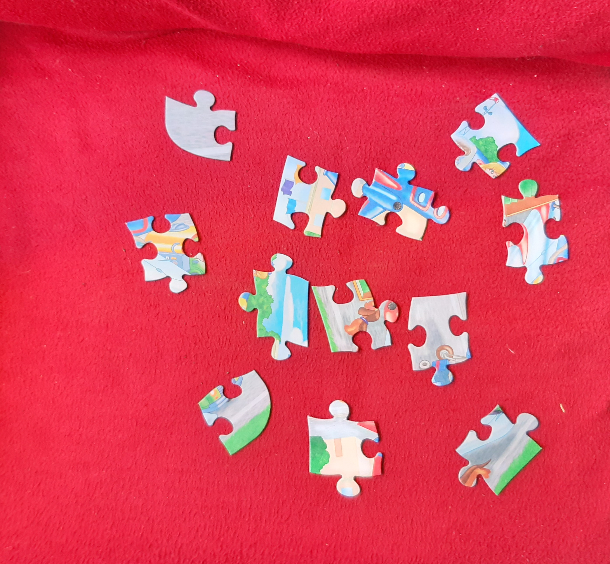

# puzzle_detection
[Report](https://yadi.sk/i/ccAbC0qE8YAPjg)  
How to run:  
```python main.py --image <image_path>```  
Example:  
```python main.py --image image/red1.jpg```  
Output:  
In folder ```image``` files ```output.png``` and ```ans.txt```  

 
